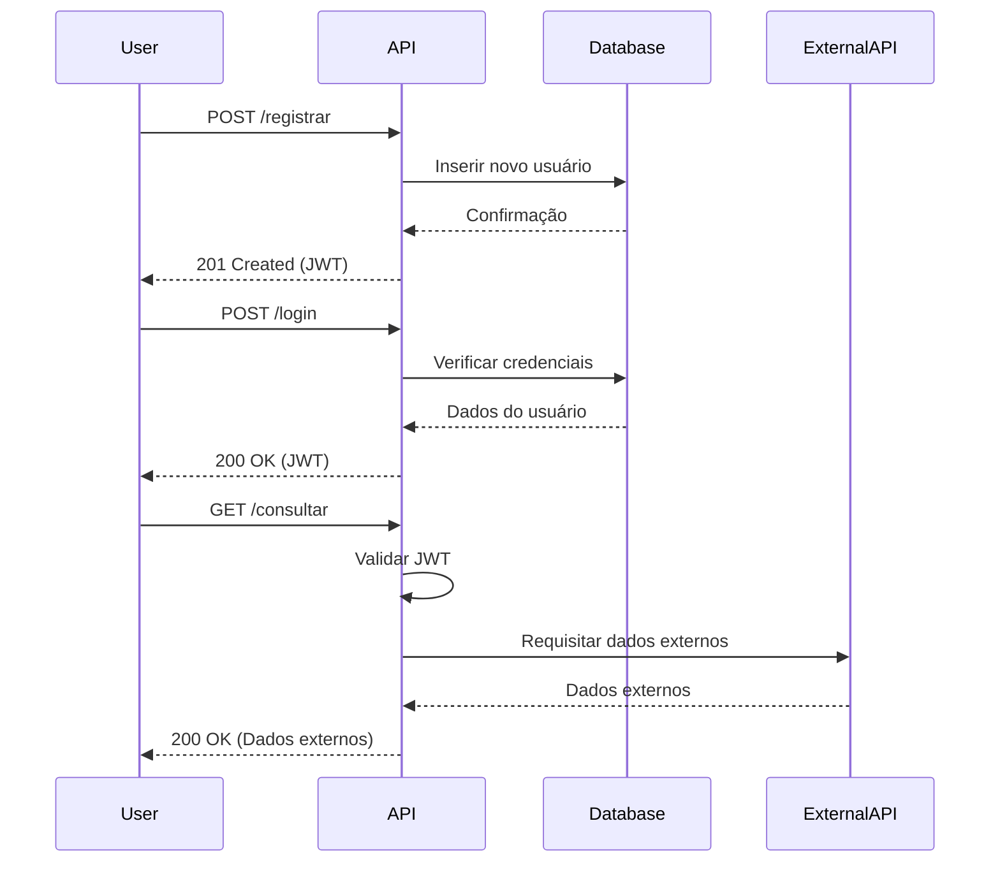
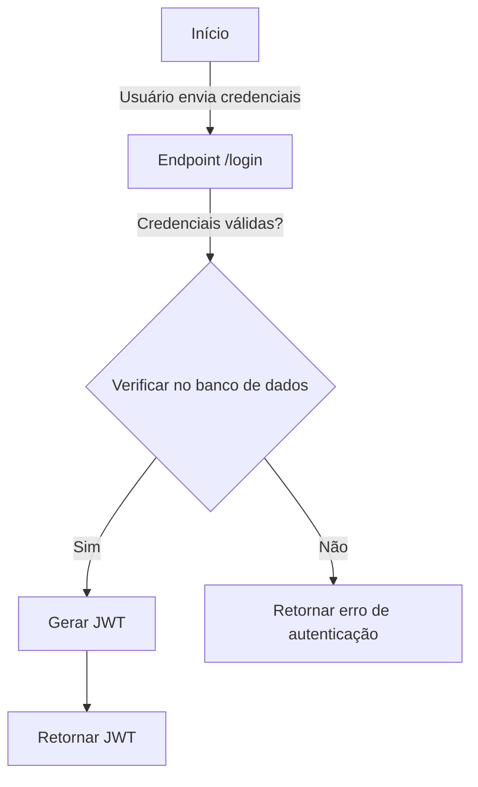
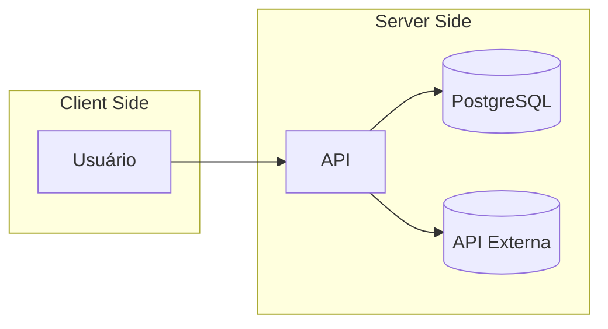

# Diagramas

Esta seção apresenta diagramas que ilustram o fluxo de operações da API Nuvem, ajudando a compreender melhor o funcionamento interno e a interação entre os componentes.

## Diagrama de Sequência

## Fluxograma de Autenticação

## Diagrama de Arquitetura

## Notas sobre os Diagramas

•	**Diagrama de Sequência:** Mostra a interação temporal entre o usuário, a API, o banco de dados e a API externa durante as operações principais.

•	**Fluxograma de Autenticação:** Ilustra o processo de autenticação do usuário e geração do token JWT.

•	**Diagrama de Arquitetura:** Fornece uma visão geral dos componentes do sistema e suas interações.